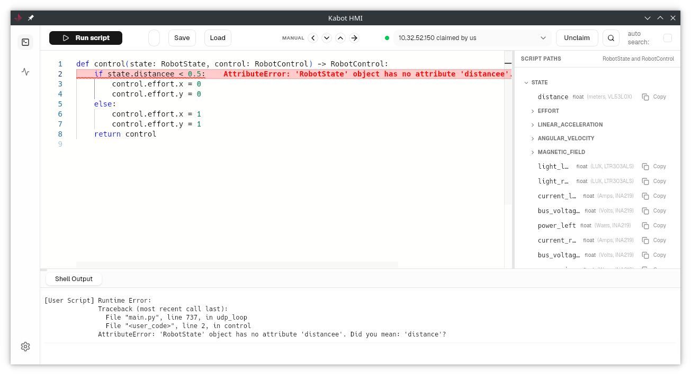
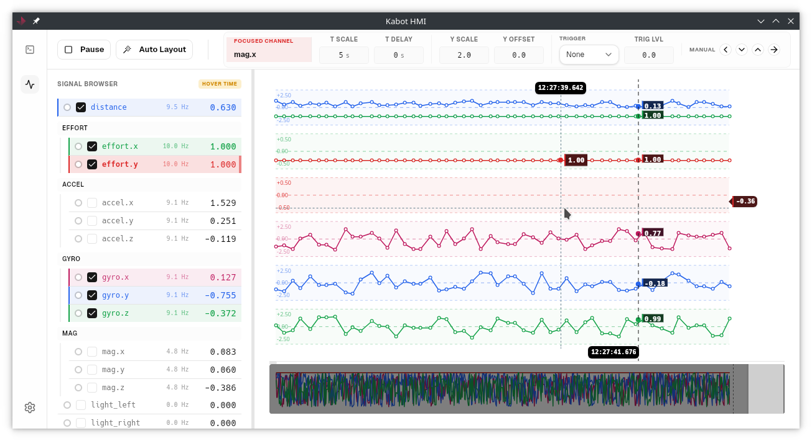
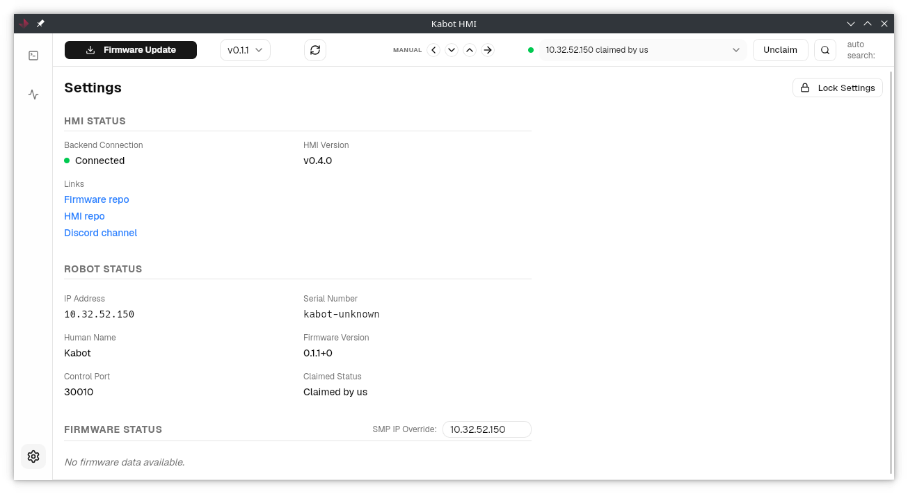

# kabot-hmi

This repository contains the source code for Human Machine Interface for Kabot robot. The builds are avaialble for Linux as AppImage on the [relases page](https://github.com/kabot-io/kabot-hmi/releases).

HMI allows for:
1. Writing python scripts that consume sensor readings and output robot controls. The editor has built-in syntax highlighting, displays runtime errors on the line in which they occured and has built-in console for print statements and exceptions. There is also built-in teleoperation mode, which allows to control the robot using keyboard.

2. Plotting all robot sensor values in real time, with the ability to select which sensors to plot, scale the axes, and inspect the values at a given timestamp.

- [firmware](https://github.com/kabot-io/kabot-zephyr/) upgrade over-the-air using [SMP protocol](https://docs.zephyrproject.org/latest/services/device_mgmt/smp_protocol.html) and inspection of robot firmware stuff:

## Running the HMI with simulated robot

To run the HMI with simulated robot, you need to have [kabot-zephyr](https://github.com/kabot-io/kabot-zephyr/) native-sim executable running. You can run it in a separate terminal using the following command.

## Architecture

The software started as a mockup of how the UI could look like. Entirety of the codebase is developed using agentic workflows - mainly Google Antigravity with Google Gemini, but also VScode using Github Copilot. The foundation was the simple model-view-controller Python Tkinter HMI that was previously part of the firmware repository. Currently the HMI is based on Next.js frontend, communicated over websockets to the Python backend, which in turn communicates with the robot firmware. The code editor is using [monaco editor](https://microsoft.github.io/monaco-editor/) ([monaco-editor/react](https://www.npmjs.com/package/@monaco-editor/react)) as it's core, and UI is composed of [shadcn/ui](https://ui.shadcn.com) components. Everything is packed together using [tauri](https://v2.tauri.app).

Due to the entirety of the codebase being written by AI, the knowledge base needed to further develop and keep everything consistent is dumped into `/docs` directory.

